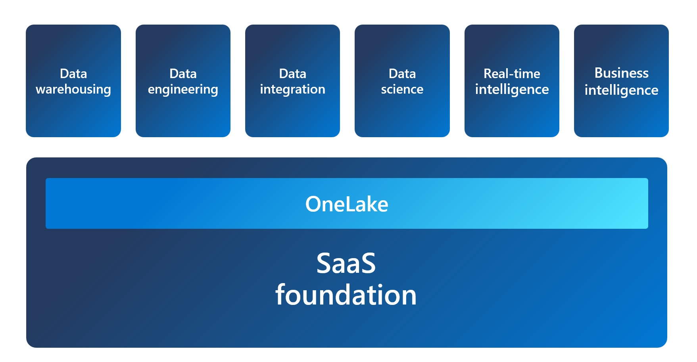
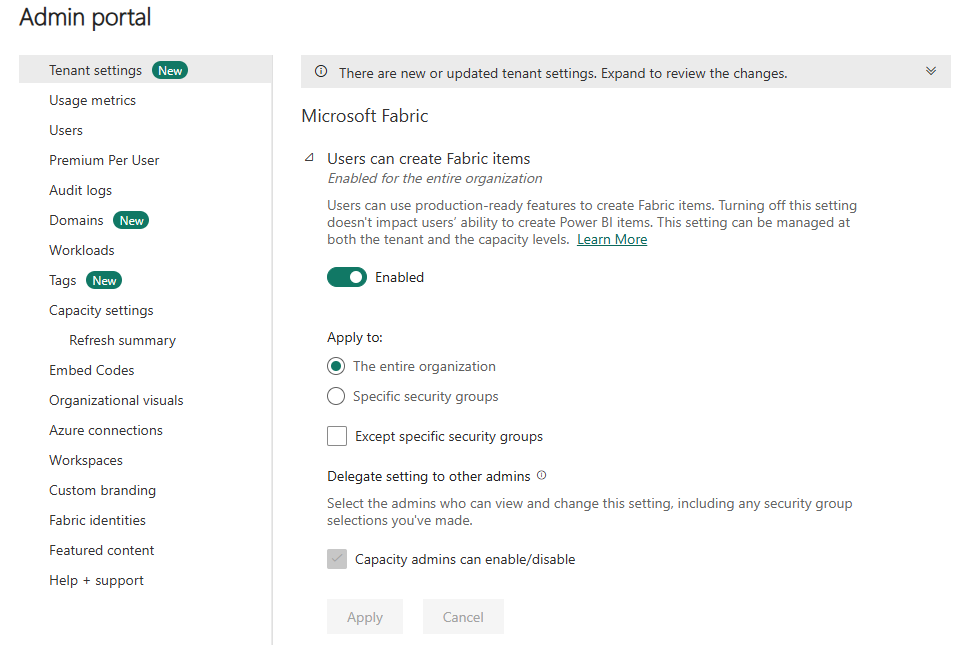
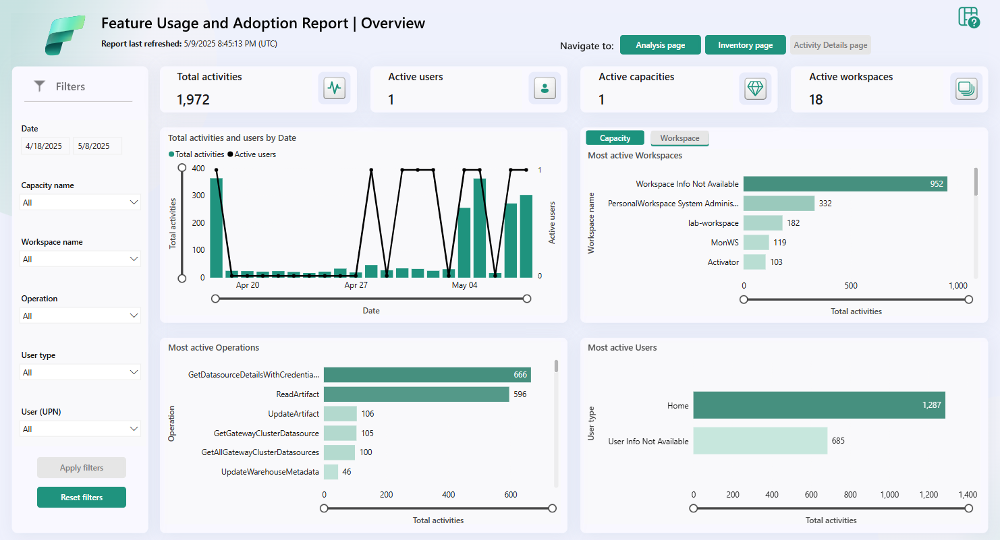

# Administration & Governance — Deep Dive

> **Source:** [MS Learn — Administer a Microsoft Fabric environment](https://learn.microsoft.com/en-us/training/modules/administer-fabric/)
> **Related pages:** [Administration & Governance (HTML)](../../big-picture/admin.html) | [Big Picture Study Guide](../../big-picture.html)

---

## Learning Objectives

- Describe Fabric admin tasks
- Navigate the admin center
- Manage user access
- Govern data in Fabric

**Prerequisites:** An understanding of the Microsoft Fabric platform and its capabilities and administrative tasks.

---

## Unit 1: Introduction

Administering a Microsoft Fabric environment involves tasks that are essential for ensuring the efficient and effective use of the Fabric platform within an organization.

As a Fabric administrator (admin), you need to know:

- Fabric architecture
- Security and governance features
- Analytics capabilities
- Deployment and licensing options

You also need to be familiar with the Fabric admin portal and other administrative tools, and be able to configure and manage the Fabric environment to meet the needs of your organization.

Fabric admins work with business users, data analysts, and IT professionals to deploy and use Fabric to meet business objectives and comply with organizational policies and standards.

By the end of this module, you'll have an understanding of the Fabric administrator role and the tasks and tools involved in administering Fabric.

---

## Unit 2: Understand the Fabric Architecture

Microsoft Fabric is a **Software-as-a-Service** platform, which provides a simple and integrated approach while reducing administrative overhead. Fabric provides an all-in-one analytics solution for enterprises that covers everything from data movement to data science, real-time analytics, and business intelligence. It offers a comprehensive suite of services, including:

- Data warehousing
- Data engineering
- Data integration
- Data science
- Real-time intelligence
- Business intelligence

All data in Fabric is stored in **OneLake**, which is built on Azure Data Lake Storage (ADLS) gen2 architecture. OneLake is hierarchical in nature to simplify management across your organization. There's only one OneLake per tenant and it provides a single-pane-of-glass file-system namespace that spans across users, regions, and even clouds.

### Understand Fabric Concepts

**Tenant** is a dedicated space for organizations to create, store, and manage Fabric items. There's often a single instance of Fabric for an organization, which is aligned with Microsoft Entra ID. The Fabric *tenant* maps to the root of OneLake and is at the top level of the hierarchy.

**Capacity** is a dedicated set of resources that is available at a given time to be used. A tenant can have one or more capacities associated with it. Capacity defines the ability of a resource to perform an activity or to produce output. Capacity needs vary by item and duration of use. Fabric offers capacity through the Fabric SKU and Trials.

**Domain** is a logical grouping of workspaces. Domains are used to organize items in a way that makes sense for your organization. You can group things together in a way that makes it easier for the groups of people to have access to workspaces. For example, you might have a domain for sales, another for marketing, and another for finance.

**Workspace** is a collection of items that brings together different functionality in a single tenant. It acts as a container that uses capacity for the work that is executed, and provides controls for who can access the items in it. For example, in a sales workspace, users associated with the sales organization can create a data warehouse, run notebooks, create datasets, create reports, and more.

**Items** are the building blocks of the Fabric platform. They're the objects that you create and manage in Fabric. There are different types of items, such as data warehouses, data pipelines, datasets, reports, and dashboards.

Understanding Fabric concepts is important for you as an admin, because it helps you understand how to manage the Fabric environment.

> **Further reading:** [Start a Fabric trial](https://learn.microsoft.com/en-us/fabric/get-started/fabric-trial)

---

## Unit 3: Understand the Fabric Administrator Role

There are several roles that work together to administer Microsoft Fabric for your organization. If you're a Microsoft 365 admin, a Power Platform admin, or a Fabric capacity admin, you're involved in administering Fabric. The Fabric admin role was formerly known as **Power BI admin**.

As a Fabric admin, you work primarily in the **Fabric admin portal**. You might also need to familiarize yourself with the following tools:

- [Microsoft 365 admin center](https://learn.microsoft.com/en-us/microsoft-365/admin/admin-overview/admin-center-overview)
- [Microsoft 365 Security & Microsoft Purview compliance portal](https://learn.microsoft.com/en-us/microsoft-365/compliance/microsoft-365-compliance-center)
- [Microsoft Entra ID in the Azure portal](https://learn.microsoft.com/en-us/azure/active-directory/fundamentals/active-directory-whatis)
- [PowerShell cmdlets](https://learn.microsoft.com/en-us/powershell/power-bi/overview)
- [Administrative APIs and SDK](https://learn.microsoft.com/en-us/rest/api/power-bi/admin)

> **Further reading:** [What is Microsoft Fabric administration?](https://learn.microsoft.com/en-us/fabric/admin/microsoft-fabric-admin)

### Describe Admin Tasks

As an admin, you might be responsible for a wide range of tasks to keep the Fabric platform running smoothly:

**Security and access control:** One of the most important aspects of Fabric administration is managing security and access control to ensure that only authorized users can access sensitive data. You can use role-based access control (RBAC) to:

- Define who can view and edit content.
- Set up data gateways to securely connect to on-premises data sources.
- Manage user access with Microsoft Entra ID.

**Data governance:** Effective Fabric administration requires a solid understanding of data governance principles. You should know how to secure inbound and outbound connectivity in your tenant and how to monitor usage and performance metrics. You should also know how to apply data governance policies to ensure data within your tenant is only accessible to authorized users.

**Customization and configuration:** Fabric administration also involves customizing and configuring the platform to meet the needs of your organization. You might configure private links to secure your tenant, define data classification policies, or adjust the look and feel of reports and dashboards.

**Monitoring and optimization:** As a Fabric admin, you need to know how to monitor the performance and usage of the platform, optimize resources, and troubleshoot issues. Examples include configuring monitoring and alerting settings, optimizing query performance, managing capacity and scaling, and troubleshooting data refresh and connectivity issues.

Specific tasks vary depending on the needs of your organization and the complexity of your Fabric implementation.

### Describe Admin Tools

It's important to familiarize yourself with a few tools to effectively implement the tasks previously outlined. Fabric admins can perform most admin tasks using one or more of the following tools: the Fabric admin portal, PowerShell cmdlets, admin APIs and SDKs, and the admin monitoring workspace.

#### Fabric Admin Portal

Fabric's *admin portal* is a web-based portal where you can manage all aspects of the platform. You can centrally manage, review, and apply settings for the entire tenant or by capacity in the admin portal. You can also manage users, admins and groups, access audit logs, and monitor usage and performance.

The admin portal enables you to turn settings on and off. There are many settings located in the admin portal. One noteworthy setting is the **Fabric on/off switch**, located in tenant settings that lets organizations that use Power BI opt into Fabric. Here, you can enable Fabric for your tenant or allow capacity admins to enable Fabric.

#### PowerShell Cmdlets

Fabric provides a set of *PowerShell cmdlets* that you can use to automate common administrative tasks. A PowerShell cmdlet is a simple command that can be executed in PowerShell.

For example, you can use cmdlets in Fabric to systematically create and manage groups, configure data sources and gateways, and monitor usage and performance. You can also use the cmdlets to manage the Fabric admin APIs and SDKs.

> **Further reading:** [Microsoft Power BI Cmdlets for Windows PowerShell and PowerShell Core](https://learn.microsoft.com/en-us/powershell/power-bi/overview)

#### Admin APIs and SDKs

An admin *API and SDK* are tools that allow developers to interact with a software system programmatically. An API (Application Programming Interface) is a set of protocols and tools that enable communication between different software applications. An SDK (Software Development Kit) is a set of tools and libraries that helps developers create software applications that can interact with a specific system or platform. You can use APIs and SDKs to automate common administrative tasks and integrate Fabric with other systems.

For example, you can use APIs and SDKs to create and manage groups, configure data sources and gateways, and monitor usage and performance. You can also use the APIs and SDKs to manage the Fabric admin APIs and SDKs.

You can make these requests using any HTTP client library that supports OAuth 2.0 authentication, such as Postman, or you can use PowerShell scripts to automate the process.

#### Admin Monitoring Workspace

Fabric tenant admins have access to the *admin monitoring workspace*. You can choose to share access to the workspace or specific items within it with other users in your organization. The admin monitoring workspace includes the **Feature Usage and Adoption** dataset and report, which together provide insights on the usage and performance of your Fabric environment. You can use this information to identify trends and patterns, and troubleshoot issues.

> **Further reading:** [What is the Fabric admin monitoring workspace](https://learn.microsoft.com/en-us/fabric/admin/monitoring-workspace)

---

## Unit 4: Manage Fabric Security

As a Fabric admin, part of your role is to manage security for the Fabric environment, including managing users and groups, and how users share and distribute content in Fabric.

### Manage Users: Assign and Manage Licenses

**User licenses** control the level of user access and functionality within the Fabric environment. Administrators ensure licensed users have the access they need to data and analytics to do their jobs effectively. They also limit access to sensitive data and ensure compliance with data protection laws and regulations.

Managing licenses allows administrators to monitor and control costs by ensuring that licenses are allocated efficiently and only to users who need them. This can help to prevent unnecessary expenses and ensure that the organization is utilizing its resources effectively.

Having the appropriate procedures in place to assign and manage licenses helps to control access to data and analytics, ensure compliance with regulations, and optimize costs.

License management for Fabric is handled in the **Microsoft 365 admin center**.

> **Note:** The *license type* in workspace settings is related to the user licenses listed here. Users can see reports depending on the user license and the workspace license. For detailed information, see the [Microsoft Fabric licenses](https://learn.microsoft.com/en-us/fabric/enterprise/licenses#workspace) documentation.

> **Further reading:** [Assign licenses to users](https://learn.microsoft.com/en-us/microsoft-365/admin/manage/assign-licenses-to-users)

### Manage Items and Sharing

As an admin, you can manage how users share and distribute content. You can manage how users share content with others, and how they distribute content to others. You can also manage how users interact with items, such as data warehouses, data pipelines, datasets, reports, and dashboards.

Items in workspaces are best distributed through a **workspace app** or the workspace directly. Granting the least permissive rights is the first step in securing the data. Share the read only app for access to the reports or grant access to the workspaces for collaboration and development. Another aspect of managing and distributing items is enforcing these types of best practices.

You can manage sharing and distribution both internally and outside of your organization, in compliance with your organization's policies and procedures.

> **Further reading:** [Security in Microsoft Fabric](https://learn.microsoft.com/en-us/fabric/security/security-overview)

---

## Unit 5: Govern Data in Fabric

Fabric includes built-in governance features to help you manage and control your data. *Endorsement* is a way for you as an admin to designate specific Fabric items as trusted and approved for use across the organization.

Admins can also make use of the *scanner API* to scan Fabric items for sensitive data, and the *data lineage* feature to track the flow of data through Fabric.

### Endorse Fabric Content

**Endorsement** is a key governance feature that builds trust in your data assets by marking Fabric items as reviewed and approved. Endorsed items display a badge, signaling to users that these assets are reliable. Endorsement helps users trust the data, and it also helps you as an admin manage the overall growth of items across your environment.

**Promoted** Fabric content appears with a Promoted badge in the Fabric portal. Workspace members with the contributor or admin role can promote content within a workspace. The Fabric admin can promote content across the organization.

**Certified** content requires a more formal process that involves a review of the content by a designated reviewer. Content appears with a Certified badge in the Fabric portal. Admins manage the certification process and can customize it to meet the needs of your organization.

If you aren't an admin, you need to request item certification from an admin. You can perform request certification by selecting the item in the Fabric portal, and then selecting **Request certification** from the **More** menu.

> **Further reading:** [Promote or certify content](https://learn.microsoft.com/en-us/fabric/get-started/endorsement-promote-certify)

### Scan for Sensitive Data

*Metadata scanning* facilitates governance of data by enabling cataloging and reporting on all the metadata of your organization's Fabric items. The *scanner API* is a set of Admin REST APIs that allows you to scan Fabric items for sensitive data. Use the scanner API to scan data warehouses, data pipelines, datasets, reports, and dashboards for sensitive data. The scanner API can be used to scan both structured and unstructured data.

> **Important:** Before metadata scanning can be run, it needs to be set up in your organization by an Admin. For more information, see the [Metadata scanning overview](https://learn.microsoft.com/en-us/fabric/governance/metadata-scanning-overview).

### Track Data Lineage

*Data lineage* is the ability to track the flow of data through Fabric, also known as *impact analysis*. Data lineage allows you to see where data comes from, how it's transformed, and where it goes. The lineage view in workspaces helps you understand the data that is available in Fabric, and how it's being used.

### Report on Sensitive Data

With the **Microsoft Purview hub** (preview) in Fabric, you can manage and govern your organization's Fabric data estate. It contains reports that provide insights about sensitive data, item endorsement, and domains, and also serves as a gateway to more advanced capabilities in the Microsoft Purview portal such as Data Catalog, Information Protection, Data Loss Prevention, and Audit.

---

## Knowledge Check

1. **Which of the following statements best describes the concept of capacity in Fabric?**
   - ~~Capacity refers to a dedicated space for organizations to create, store, and manage Fabric items.~~
   - **Capacity defines the ability of a resource to perform an activity or to produce output.** ✓
   - ~~Capacity is a collection of items that are logically grouped together.~~

2. **Which of the following statements is true about the difference between promotion and certification in Fabric?**
   - ~~Promotion and certification both allow any workspace member to endorse content.~~
   - ~~Promotion requires a higher level of permissions than certification.~~
   - **Certification must be enabled in the tenant by the admin, while promotion can be done by a workspace member.** ✓

---

## Summary

In this module, you learned about the Fabric architecture and the role of an administrator for the Fabric platform. You also explored the different tools available for managing security and sharing, as well as the governance features that can be used to enforce standards and ensure compliance. Your understanding of how to manage a Fabric environment ensures that it's secure, compliant, and well-governed. With this knowledge, you're well-equipped to help your organization get the most out of Fabric and derive valuable insights from all your data.

Key takeaways:
- **Fabric is SaaS** — provides an all-in-one analytics solution covering data warehousing, engineering, integration, science, real-time intelligence, and BI
- **OneLake** — single storage layer built on ADLS Gen2, one per tenant, hierarchical namespace spanning users, regions, and clouds
- **Core concepts** — Tenant, Capacity, Domain, Workspace, Items form the hierarchy of Fabric
- **Admin role** — formerly Power BI admin; uses the Fabric admin portal, PowerShell cmdlets, admin APIs/SDKs, and admin monitoring workspace
- **Admin tasks** — security & access control, data governance, customization & configuration, monitoring & optimization
- **Security** — user license management (via Microsoft 365 admin center), item sharing, least-permissive rights, workspace apps
- **Governance** — endorsement (Promoted vs Certified badges), scanner API for sensitive data, data lineage tracking, Microsoft Purview hub

---

## Links

- [What is Microsoft Fabric administration?](https://learn.microsoft.com/en-us/fabric/admin/microsoft-fabric-admin)
- [Start a Fabric trial](https://learn.microsoft.com/en-us/fabric/get-started/fabric-trial)
- [Security in Microsoft Fabric](https://learn.microsoft.com/en-us/fabric/security/security-overview)
- [Microsoft Fabric licenses](https://learn.microsoft.com/en-us/fabric/enterprise/licenses)
- [Promote or certify content](https://learn.microsoft.com/en-us/fabric/get-started/endorsement-promote-certify)
- [Metadata scanning overview](https://learn.microsoft.com/en-us/fabric/governance/metadata-scanning-overview)
- [Fabric admin monitoring workspace](https://learn.microsoft.com/en-us/fabric/admin/monitoring-workspace)
- [Govern data in Microsoft Fabric with Purview (MS Learn module)](https://learn.microsoft.com/en-us/training/modules/fabric-data-governance-purview/)
