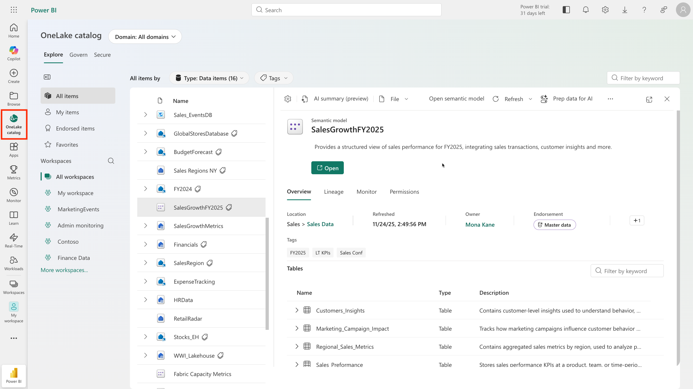

# Introduction to Fabric — Deep Dive

> **Source:** [MS Learn — Introduction to end-to-end analytics using Microsoft Fabric](https://learn.microsoft.com/en-us/training/modules/introduction-end-analytics-use-microsoft-fabric/)
> **Related pages:** [Introduction to Fabric (HTML)](../../big-picture/introduction.html) | [Big Picture Study Guide](../../big-picture.html)

---

## Learning Objectives

- Identify the capabilities of Microsoft Fabric.
- Implement Microsoft Fabric to meet your enterprise's analytics needs.
- Describe how Fabric supports AI capabilities through Copilot, data agents, and Fabric IQ.

---

## Unit 1: Introduction

Organizations need to ingest, prepare, govern, and analyze data at scale, often across disconnected tools and teams. Increasingly, that same data also needs to be ready for AI workloads like machine learning models, Copilots, and intelligent agents. Managing these tasks across separate systems creates complexity, governance gaps, and duplicated effort.

**Microsoft Fabric** is an end-to-end analytics platform that provides a single, integrated environment where data professionals and the business collaborate on data projects. Built on a unified data lake called **OneLake**, Fabric brings together the tools you need across the entire data lifecycle.

Because all data is ingested, prepared, and governed within Fabric, the same data that powers your reports and dashboards is also available to AI capabilities like Copilot, data agents, and Fabric IQ. The work you do to organize and govern your data directly supports your organization's AI initiatives.

---

## Unit 2: Explore End-to-End Analytics with Microsoft Fabric

Scalable analytics can be complex, fragmented, and expensive. Microsoft Fabric simplifies analytics solutions by providing a single, easy-to-use product that integrates various tools and services into one platform.

Fabric is a unified *software-as-a-service* (SaaS) platform where all data is stored in a single open format in OneLake. All analytics engines in the platform can access OneLake, ensuring scalability, cost-effectiveness, and accessibility from anywhere with an internet connection.

### OneLake

**OneLake** is Fabric's centralized data storage architecture that enables collaboration by eliminating the need to move or copy data between systems. OneLake unifies your data across regions and clouds into a single logical lake without moving or duplicating data.

*All Fabric compute engines access the same OneLake data storage — no movement or duplication needed*

Key details:
- Built on **Azure Data Lake Storage Gen2** (ADLS Gen2)
- Supports various formats: Delta, Parquet, CSV, and JSON
- All compute engines in Fabric automatically store their data in OneLake — no movement or duplication needed
- For tabular data, the analytical engines write data in **delta-parquet format** and all engines interact with the format seamlessly

**Shortcuts** are references to files or storage locations within OneLake or external data sources, such as Azure Data Lake Storage, Amazon S3, or Dataverse. Shortcuts allow you to access existing data without copying it, ensuring data consistency and enabling Fabric to stay in sync with the source.

Because all Fabric workloads store data in OneLake using an open format, AI capabilities like Copilot and data agents can access the same governed data as your reports and dashboards **without separate data preparation pipelines**. The work you do to ingest, prepare, and govern data in Fabric is what makes that data available for AI workloads.

### Workspaces

In Microsoft Fabric, **workspaces** serve as logical containers that help you organize and manage your data, reports, and other assets:

- Each workspace has its own set of permissions, ensuring that only authorized users can view or modify its contents
- Workspaces support team collaboration while maintaining strict access control for both business and IT users
- You can manage compute resources and integrate with Git for version control
- Git integration helps track changes, collaborate on code, and maintain a history of your work

### Administration and Governance

Fabric's OneLake is centrally governed and open for collaboration. Data is secured and governed in one place, which allows users to easily find and access the data they need.

- **Admin portal** — manage groups and permissions, configure data sources and gateways, monitor usage and performance. Also access Fabric admin APIs and SDKs to automate common tasks and integrate Fabric with other systems.
- **OneLake catalog** — analyze, monitor, and maintain data governance. Provides guidance on sensitivity labels, item metadata, and data refresh status, offering insights into the governance status and actions for improvement.

> **Further reading:** [Microsoft Fabric administration](https://learn.microsoft.com/en-us/fabric/admin)

---

## Unit 3: Explore Data Teams and Microsoft Fabric

Microsoft Fabric's unified data analytics platform makes it easier for data professionals to collaborate on projects. Fabric increases collaboration between data professionals by removing data silos and the need for multiple systems.

### Traditional Roles and Challenges

In a traditional analytics development process, data teams face several challenges due to the division of data tasks and workflows:

- **Data engineers** process and curate data for analysts, requiring extensive coordination, often leading to delays and misinterpretations
- **Data analysts** often need to perform downstream data transformations before creating Power BI reports — time-consuming and lacking context
- **Data scientists** face difficulties integrating native data science techniques with existing systems

### Evolution of Collaborative Workflows

Microsoft Fabric simplifies the analytics development process by unifying tools into a SaaS platform:

| Role | What They Do in Fabric |
|---|---|
| **Data engineers** | Ingest, transform, and load data into OneLake using Pipelines. Store data in lakehouses using Delta-Parquet format. Use Notebooks for advanced scripting. |
| **Analytics engineers** | Bridge engineering and analysis by curating data assets in lakehouses, ensuring data quality, and creating semantic models in Power BI. |
| **Data analysts** | Transform data upstream using dataflows. Connect directly to OneLake with Direct Lake mode. Create interactive reports in Power BI. |
| **Data scientists** | Use integrated notebooks with Python and Spark to build ML models. Store/access data in lakehouses. Integrate with Azure Machine Learning. Predictions serve as grounding data for Copilot and AI agents. |
| **Low-to-no-code users** | Discover curated datasets through OneLake catalog. Use Power BI templates for reports. Use dataflows for simple ETL. Ask questions in natural language using Copilot. |

**Key insight:** Every role in the data team contributes to the organization's ability to use AI effectively. Data engineers who maintain clean, well-governed data in OneLake build the foundation that Copilot and AI agents rely on. Analytics engineers who create consistent semantic models give AI tools the business context needed to generate accurate, meaningful answers.

---

## Unit 4: Enable and Use Microsoft Fabric

### Enable Microsoft Fabric

Before you can explore the end-to-end capabilities of Microsoft Fabric, it must be enabled for your organization. The following roles can enable it:

- **Fabric administrator** — manages Fabric settings and configurations
- **Power Platform administrator** — oversees Power Platform services, including Fabric
- **Global administrator** — has implicit Fabric admin rights through organization-wide permissions

Admins enable Fabric in the **Admin portal → Tenant settings** in the Power BI service. Fabric can be enabled for:
- The entire organization
- Specific Microsoft 365 or Microsoft Entra security groups
- Delegated to other users at the capacity level

> **Tip:** If your organization isn't using Fabric or Power BI today, you can sign up for a [free Fabric trial](https://learn.microsoft.com/en-us/fabric/get-started/fabric-trial) to explore its features.

### Create Workspaces

Workspaces are collaborative environments where you create and manage items like lakehouses, warehouses, and reports. All data is stored in OneLake and accessed through workspaces.

In **Workspace settings**, you can configure:
- License type to use Fabric features
- OneDrive access for the workspace
- Azure Data Lake Gen2 Storage connection
- Git integration for version control
- Spark workload settings for performance optimization

**Workspace roles** (four levels):
1. **Admin** — full control
2. **Member** — can create and edit
3. **Contributor** — can create and edit items
4. **Viewer** — read-only access

These roles apply to all items in a workspace and should be reserved for collaboration. For more granular access control, use **item-level permissions** based on business needs.

### Discover Data with OneLake Catalog

The OneLake catalog helps you find and access data sources within your organization. You only see items that have been shared with you.

*The OneLake catalog — discover and connect to data sources across your organization*

Tips for using OneLake catalog:
- Narrow results by workspaces or domains (if implemented)
- Explore default categories to quickly locate relevant data
- Filter by keyword or item type

### Create Items with Fabric Workloads

After creating a Fabric-enabled workspace, you can start creating items. Each workload offers different item types:

| Workload | Purpose |
|---|---|
| **Data Engineering** | Create lakehouses and operationalize workflows to build, transform, and share your data estate |
| **Data Factory** | Ingest, transform, and orchestrate data |
| **Data Warehouse** | Combine multiple sources in a traditional warehouse for analytics |
| **Real-Time Intelligence** | Process, monitor, and analyze streaming data |
| **Industry Solutions** | Use out-of-the-box industry data solutions |
| **Data Science** | Detect trends, identify outliers, and predict values using machine learning |
| **Databases** | Create and manage databases with tools to insert, query, and extract data |
| **IQ (preview)** | Unify data across OneLake and organize it using ontologies, graphs, and semantic models |
| **Power BI** | Create reports and dashboards to make data-driven decisions |

Fabric integrates capabilities from existing Microsoft tools (Power BI, Azure Synapse Analytics, Azure Data Factory) into a unified platform. It also supports a **data mesh architecture**, allowing decentralized data ownership while maintaining centralized governance.

### AI Capabilities in Microsoft Fabric

#### Fabric IQ (preview)

A Fabric workload for unifying data across OneLake and organizing it according to the language of your business. Its core item is the **ontology**, which defines your business concepts, relationships, and rules so that AI agents can reason across domains using consistent business language rather than raw table schemas.

Fabric IQ is one of **three IQ workloads** that Microsoft provides:

| IQ Workload | What It Models |
|---|---|
| **Fabric IQ** | Business data — ontologies, semantic models, and graphs so agents can reason over analytics in OneLake and Power BI |
| **Foundry IQ** | Structured and unstructured data across Azure, SharePoint, OneLake, and the web — permission-aware enterprise knowledge |
| **Work IQ** | Collaboration signals from documents, meetings, chats, and workflows — insight into how your organization operates |

Each IQ workload is standalone, but you can use them together to provide comprehensive organizational context for agents.

#### Fabric Data Agents

Data agents let you build conversational interfaces where users ask questions about organizational data in natural language. Agents translate those questions into structured queries across your lakehouses, warehouses, and semantic models.

In the Fabric IQ workload, data agents can connect to your **ontology** as a source, enabling them to understand and use your business concepts when answering questions.

#### Copilot Across Workloads

Microsoft Copilot in Fabric is a generative AI assistant available across all Fabric workloads:

- **Code completion and generation** — intelligent code suggestions in notebooks, SQL queries from natural language, questions translated into KQL for real-time analysis
- **Data transformation guidance** — in Data Factory, supports both citizen and professional data wranglers with code generation and plain-language explanations of complex logic
- **Report and insight generation** — in Power BI, generates reports automatically, creates page summaries, and lets users ask questions in natural language

> **Note:** Copilot is enabled by default. Administrators can disable it from **Admin portal → Tenant settings** or control access for specific security groups or at the capacity level.

---

## Knowledge Check

1. **What is a key benefit of using Microsoft Fabric in data projects?**
   - ~~It allows data professionals to work independently, without collaboration~~
   - ~~It requires duplicating data across systems to ensure availability~~
   - **It provides a single, integrated environment for collaboration on data projects** ✓

2. **What is the default storage format for Fabric's OneLake?**
   - **Delta-Parquet** ✓
   - ~~JSON~~
   - ~~CSV~~

3. **Which Fabric experience is used to move and transform data?**
   - ~~Data Science~~
   - ~~Data Warehousing~~
   - **Data Factory** ✓

4. **Why is OneLake's unified storage model important for AI capabilities in Fabric?**
   - ~~It requires all data to be converted to a proprietary format for AI processing~~
   - **AI tools like Copilot and data agents can access the same governed data without separate preparation pipelines** ✓
   - ~~It stores AI models alongside the data they process~~

---

## Summary

Microsoft Fabric provides a unified foundation for both analytics and AI. Key takeaways:

- **OneLake** is the centralized storage architecture — all workloads read/write from the same place in delta-parquet format
- **Workspaces** provide logical containers with access control, Git integration, and compute management
- **Nine workloads** serve different analytics needs (Data Engineering, Data Factory, Data Warehouse, Real-Time Intelligence, Data Science, Databases, Industry Solutions, IQ, Power BI)
- **Data teams collaborate** more effectively because tools are unified — no silos, no duplication
- **AI capabilities** (Copilot, data agents, Fabric IQ) build on top of well-governed data — the same data that powers reports also powers AI
- **Three IQ workloads** (Fabric IQ, Foundry IQ, Work IQ) position Fabric as both a data platform and an intelligence platform

---

## Links

- [What's new in Microsoft Fabric?](https://learn.microsoft.com/en-us/fabric/fundamentals/whats-new)
- [Migrate to Microsoft Fabric](https://learn.microsoft.com/en-us/fabric/fundamentals/migration)
- [Microsoft Fabric administration](https://learn.microsoft.com/en-us/fabric/admin)
- [Fabric trial setup](https://learn.microsoft.com/en-us/fabric/get-started/fabric-trial)
- [Fabric documentation](https://learn.microsoft.com/en-us/fabric/get-started/workspaces)
