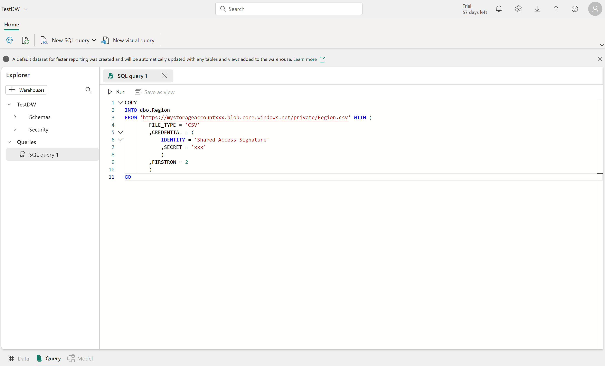
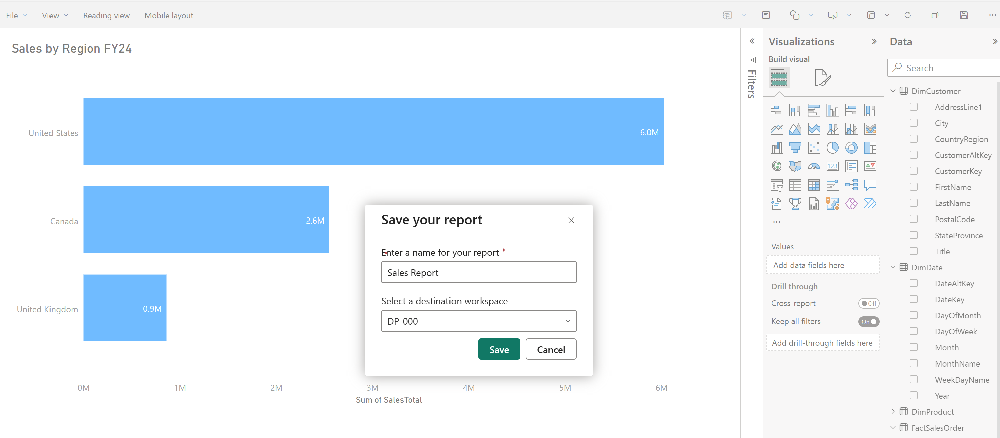

# Lakehouse & Warehouse — Deep Dive

> **Source:** [MS Learn — Get started with data warehouses in Microsoft Fabric](https://learn.microsoft.com/en-us/training/modules/get-started-data-warehouse/)
> **Related pages:** [Lakehouse & Warehouse (HTML)](../../big-picture/lakehouse-warehouse.html) | [Big Picture Study Guide](../../big-picture.html)

---

## Learning Objectives

- Describe data warehouse concepts and dimensional modeling fundamentals.
- Create tables, load data, and understand ingestion methods in a Fabric warehouse.
- Query and transform data using T-SQL and the visual query editor.
- Model warehouse data for reporting and downstream consumption.
- Secure and monitor a data warehouse.

---

## Unit 1: Introduction

Relational data warehouses are at the center of most enterprise business intelligence (BI) solutions. They provide a structured, SQL-based environment where organizations store, query, and analyze business data at scale.

Microsoft Fabric provides a fully managed data warehouse with full transactional T-SQL capabilities, including the ability to create tables and insert, update, and delete data. Because warehouse data is stored in Delta format on OneLake, it integrates seamlessly with other Fabric workloads. This makes the data warehouse a core component of your end-to-end analytics solution and part of the intelligent data foundation that supports Copilot experiences and AI-driven insights across the platform.

**Scenario:** Suppose you work at a retail organization that stores structured business data across multiple systems. Your team needs to centralize this data for analytics and reporting using familiar SQL tools. You need to understand when a Fabric data warehouse is the right choice, how to create one, and how to query and transform data using T-SQL.

In this module, you explore the fundamentals of dimensional modeling with fact and dimension tables, then discover what makes Fabric's data warehouse unique, including full T-SQL support with MERGE capabilities, Copilot-assisted query authoring, and seamless integration with OneLake. You practice querying data, structuring tables, and explore the security and monitoring features that keep your warehouse governed and performant. By the end of this module, you'll know how to build a warehouse that serves both human analysts and AI-powered experiences.

---

## Unit 2: Understand Data Warehouses

A data warehouse is a centralized, structured store designed for analytical queries and reporting. Unlike operational databases that handle day-to-day business transactions, a data warehouse consolidates data from multiple sources into a format optimized for analysis.

Building a modern data warehouse typically involves:

- **Data ingestion** — Moving data from source systems into the warehouse.
- **Data storage** — Storing the data in a format optimized for analytics.
- **Data processing** — Transforming the data into a format ready for consumption by analytical tools.
- **Data analysis and delivery** — Analyzing the data to gain insights and delivering them to the business.

### Design a Data Warehouse

Data warehouses contain tables organized in a schema optimized for multidimensional modeling. In this approach, you group numerical data related to events by different attributes. For instance, you can analyze the total amount paid for sales orders that occurred on a specific date or at a particular store.

### Tables in a Data Warehouse

You organize data warehouse tables to support efficient analysis of large amounts of data. This organization, known as dimensional modeling, involves structuring tables into fact tables and dimension tables.

**Fact tables** contain the numerical data that you want to analyze. Fact tables typically have a large number of rows and are the primary source of data for analysis. For example, a fact table might contain the total amount paid for sales orders that occurred on a specific date or at a particular store.

**Dimension tables** contain descriptive information about the data in the fact tables. Dimension tables typically have a few rows and provide context for the data in the fact tables. For example, a dimension table might contain information about the customers who placed sales orders.

In addition to attribute columns, a dimension table contains a unique key column that uniquely identifies each row in the table. In fact, it's common for a dimension table to include two key columns:

- A **surrogate key** is a unique identifier for each row in the dimension table. It's often an integer value that the database management system generates automatically when you insert a new row.
- An **alternate key** is often a natural or business key that identifies a specific instance of an entity in the transactional source system — such as a product code or a customer ID.

You need both surrogate and alternate keys in a data warehouse, because they serve different purposes. Surrogate keys are specific to the data warehouse and help maintain consistency and accuracy. Alternate keys are specific to the source system and help maintain traceability between the data warehouse and the source system.

### Special Types of Dimension Tables

**Time dimensions** provide information about the time period in which an event occurred. This table enables data analysts to aggregate data over temporal intervals. For example, a time dimension might include columns for the year, quarter, month, and day of a sales order.

**Slowly changing dimensions** track changes to dimension attributes over time, like changes to a customer's address or a product's price. They're significant in a data warehouse because they enable you to analyze and understand changes to data over time. Slowly changing dimensions ensure that data stays up-to-date and accurate, which is important for making good business decisions.

### Data Warehouse Schema Designs

In most transactional databases used in business applications, the data is *normalized* to reduce duplication. In a data warehouse however, the dimension data is *denormalized* to reduce the number of joins required to query the data.

**Star schema** — a fact table relates directly to the dimension tables:


You can use dimension attributes to group fact table numbers at different levels. For example, you could find the total sales revenue for a whole region or just for one customer. You can store the information for each level in the same dimension table.

> **Tip:** See [What is a star schema?](https://learn.microsoft.com/en-us/power-bi/guidance/star-schema) for more information on designing star schemas for Fabric.

**Snowflake schema** — if there are lots of levels or attributes shared by different things, it might make sense to use a snowflake schema instead:


In this case, the **DimProduct** table splits (normalizes) into separate dimension tables for product categories and suppliers.

- Each row in the **DimProduct** table contains key values for the corresponding rows in the **DimCategory** and **DimSupplier** tables.

A **DimGeography** table contains information on where customers and stores are located.

- Each row in the **DimCustomer** and **DimStore** tables contains a key value for the corresponding row in the **DimGeography** table.

---

## Unit 3: Understand Data Warehouses in Fabric

### Describe a Fabric Data Warehouse

A Fabric data warehouse is a fully managed, enterprise-scale relational database built on OneLake. It provides full transactional T-SQL capabilities, including DDL statements (CREATE, ALTER, DROP) and DML statements (INSERT, UPDATE, DELETE, MERGE), with full ACID compliance for data consistency.

Data is stored in open Delta format on OneLake, which means other Fabric workloads can access the same data without duplication. You use T-SQL to create tables, load data, build views and stored procedures, and perform transformations, all within a familiar SQL experience.

Key capabilities include:

- **Full T-SQL support** — Write DDL and DML statements, including MERGE for upsert scenarios, using familiar SQL Server syntax.
- **Fully managed** — No infrastructure to configure. Compute scales automatically and independently from storage.
- **OneLake integration** — Warehouse data is stored in Delta format and accessible by other Fabric workloads without duplication.
- **Cross-database querying** — Query data across warehouses and lakehouses without copying data. Use three-part naming (database.schema.table) to join warehouse tables with lakehouse tables in a single query.
- **Familiar tooling** — Connect with SQL Server Management Studio (SSMS), Azure Data Studio, or any SQL client through standard TDS connections.
- **Copilot assistance** — Copilot for Data Warehouse generates SQL queries from natural language, provides code completion as you type, and can explain or fix existing queries in the SQL editor.

### Warehouse vs SQL Analytics Endpoint

| Capability | Warehouse | SQL Analytics Endpoint |
|---|---|---|
| Read data | Yes | Yes |
| Write data (INSERT, UPDATE, DELETE, MERGE) | Yes | No |
| Create tables (DDL) | Yes | No |
| Create views and stored procedures | Yes | Yes |
| Data source | Native warehouse tables | Lakehouse Delta tables |

Use a warehouse when you need full read/write T-SQL capabilities. Use the SQL analytics endpoint when you need read-only SQL access to lakehouse data.

### Create a Data Warehouse

You can create a data warehouse in Fabric from the **create hub** or within a **workspace**. After creating an empty warehouse, you can add tables, views, and other objects.


Once your warehouse is created, you can start creating tables and loading data using the SQL query editor in the Fabric portal.

### Ingest Data into a Warehouse

There are several ways to load data into a Fabric data warehouse:

| Method | Description |
|---|---|
| **COPY INTO** | Bulk load data from external files (CSV, Parquet) in Azure storage into warehouse tables. |
| **OPENROWSET** | Query files directly from external storage or OneLake locations for ad hoc analysis or ingestion, without creating tables first. |
| **Pipelines and Dataflows** | Use Data Factory pipelines or Dataflows Gen2 for orchestrated data movement and transformation. |
| **Cross-database queries** | Query lakehouse tables directly from the warehouse using three-part naming, without copying data. |

You can use the `COPY INTO` T-SQL command to bulk load data from files. For example:

```sql
COPY INTO dbo.Region
FROM 'https://mystorageaccount.blob.core.windows.net/data/Region.csv'
WITH (
    FILE_TYPE = 'CSV',
    CREDENTIAL = (
        IDENTITY = 'Shared Access Signature',
        SECRET = 'xxx'
    ),
    FIRSTROW = 2
)
GO
```



> **Tip:** If you have tables in a lakehouse that you want to query from your warehouse without making changes, use cross-database querying instead. You don't need to copy the data.

### Create Tables and Load Data

You create tables using T-SQL `CREATE TABLE` statements. Define columns with appropriate data types for analytics workloads.

```sql
CREATE TABLE dbo.DimCustomer
(
    CustomerKey INT NOT NULL,
    CustomerAltKey NVARCHAR(10) NOT NULL,
    CustomerName NVARCHAR(100) NOT NULL,
    Region NVARCHAR(50) NULL
);
GO

CREATE TABLE dbo.FactSales
(
    SalesKey INT NOT NULL,
    CustomerKey INT NOT NULL,
    ProductKey INT NOT NULL,
    DateKey INT NOT NULL,
    SalesAmount DECIMAL(10,2) NOT NULL,
    Quantity INT NOT NULL
);
GO
```

Choose data types that balance precision with storage efficiency. Use `INT` for key columns, `NVARCHAR` for text that may include special characters, and `DECIMAL` for financial values that require precision.

### Use Staging Tables for Data Loading

A common pattern in data warehousing is to land raw data in staging tables before transforming and loading it into final dimension and fact tables. Staging tables mirror the structure of your source data and act as a temporary holding area.

After loading data into staging tables using `COPY INTO` or pipelines, you transform and insert it into your dimensional model:

```sql
INSERT INTO dbo.FactSales (SalesKey, CustomerKey, ProductKey, DateKey, SalesAmount, Quantity)
SELECT
    s.OrderID,
    c.CustomerKey,
    p.ProductKey,
    d.DateKey,
    s.Amount,
    s.Qty
FROM dbo.StgSales AS s
INNER JOIN dbo.DimCustomer AS c ON s.CustomerID = c.CustomerAltKey
INNER JOIN dbo.DimProduct AS p ON s.ProductID = p.ProductAltKey
INNER JOIN dbo.DimDate AS d ON s.OrderDate = d.DateValue;
GO
```

This pattern keeps your source data intact while you apply business rules and key lookups during the load process.

### Understand Table Clones

You can create zero-copy table clones in a Fabric data warehouse. Clones copy table metadata while still referencing the same underlying data files in OneLake. The data itself isn't duplicated, which keeps storage costs low.

```sql
--Clone creation within the same schema
CREATE TABLE dbo.Employee AS CLONE OF dbo.EmployeeUSA;
```

Table clones are useful for development and testing, data recovery after a failed release, and preserving data at specific points in time for historical reporting.

> **Further reading:** [Clone table in Microsoft Fabric](https://learn.microsoft.com/en-us/fabric/data-warehouse/clone-table)

---

## Unit 4: Query and Transform Data

Raw data rarely arrives in the exact format you need for analysis. You might need to join tables, filter rows, aggregate values, or restructure data before it's useful for reporting. A Fabric data warehouse gives you two tools for this work: the SQL query editor for T-SQL and the Visual query editor for a no-code approach.

### Query Data with the SQL Query Editor

The **SQL query editor** provides a query experience that includes IntelliSense, code completion, syntax highlighting, client-side parsing, and validation. This will feel familiar if you have experience writing T-SQL in SQL Server Management Studio (SSMS) or Azure Data Studio (ADS).

To create a new query, use the **New SQL query** button in the menu. Copilot for Data Warehouse is available in the editor to help generate queries from natural language, complete code as you type, and explain or fix existing queries.

### Query Data with the Visual Query Editor

The **Visual query editor** provides an experience similar to the Power Query online diagram view. Use the **New visual query** button to create a new query.

Drag a table from your data warehouse onto the canvas to get started. You can then use the **Transform** menu at the top of the screen to add columns, filters, and other transformations. You can also use the (+) button on the visual itself to perform similar actions.


### Transform Data with Views and Stored Procedures

Beyond ad hoc queries, you can save transformation logic as reusable objects in the warehouse.

**Views** define a saved query that you can reference like a table. Use views to standardize how analysts access data, such as combining fact and dimension tables into a reporting-friendly format or filtering rows to a specific business context.

**Stored procedures** contain T-SQL logic that you can execute on demand. Use stored procedures for repeatable transformation tasks, like loading staging data into final tables or applying business rules.

Views and stored procedures also help make your data more accessible to AI-powered tools. Copilot and Fabric IQ data agents can query views just like tables, so standardizing data access through well-named views improves the accuracy of natural language queries.

```sql
CREATE VIEW dbo.vw_SalesByRegion
AS
SELECT
    c.Region,
    SUM(f.SalesAmount) AS TotalSales,
    COUNT(f.OrderID) AS OrderCount
FROM dbo.FactSales AS f
INNER JOIN dbo.DimCustomer AS c
    ON f.CustomerKey = c.CustomerKey
GROUP BY c.Region;
```


---

## Unit 5: Model Data in a Warehouse

Without data modeling, every consumer has to figure out which tables relate to each other, write their own aggregation logic, and guess at column meanings. Data modeling solves this problem by embedding structure, business logic, and documentation directly into the warehouse. In a Microsoft Fabric warehouse, you prepare data for clarity, define relationships between tables, standardize access through views and measures, and publish semantic models for reporting. These modeling choices affect every downstream experience, including T-SQL queries, Power BI reports, and AI-driven natural language analytics.

### Prepare Data for Consumption

Before you define relationships or add calculations, you need to clean up what consumers see. Raw warehouse tables often contain staging tables, surrogate key columns, and internal flags that are meant for ETL processing, not for analysis.

In the model view, you can take several steps to improve the consumer experience:

- **Hide internal objects** like staging tables, surrogate key columns, and ETL artifacts that clutter the field list.
- **Rename columns** to use business-friendly names where the warehouse column names are technical or abbreviated. For example, rename `CustRgn` to `Customer Region`.
- **Add descriptions** to tables and columns so that consumers understand what the data represents without referring to external documentation.

These steps matter beyond just tidiness. Copilot in Power BI and Fabric IQ data agents rely on table names, column names, and descriptions to interpret natural language questions and generate accurate SQL or DAX. A column named `Customer Region` with a description like "Geographic region of the customer's primary address" produces better natural language results than `CustRgn` with no description.

### Understand Relationships Between Tables

A relationship is a logical connection between two tables that enables filtering, grouping, and aggregation across those tables. In a star schema, relationships connect fact tables to dimension tables through shared key columns.

For example, a `CustomerKey` column that exists in both `FactSales` and `DimCustomer` establishes the link that enables analysis of sales by customer attributes like region, segment, or account type.

Each relationship has two important properties:

- **Cardinality** describes how rows in the two tables correspond. In a star schema, fact-to-dimension relationships are typically many-to-one, meaning many fact rows map to a single dimension row.
- **Cross-filter direction** determines which way filters propagate between the tables. Single direction, where the dimension filters the fact table, is the standard setting for most star schema designs because it keeps filter behavior predictable and performant.

Without defined relationships, every consumer who wants to combine data across tables needs to write explicit JOIN logic. Relationships eliminate that repetition by encoding the connection once. When you create a semantic model from the warehouse, these relationships inform how Power BI, Copilot, and Fabric IQ data agents interpret the data. Data agents, for example, use relationships to generate accurate joins when translating natural language questions into SQL.

> **Note:** Most data warehouses use dimensional modeling. Relationships can be created to shape a **star schema**, which is an ideal model for analytics. For more information, see the [Design dimensional models in Microsoft Fabric](https://learn.microsoft.com/en-us/training/modules/design-dimensional-models-fabric) module.

### Standardize Data Access with Views and Measures

**Views** provide consistency for T-SQL consumers. A view encapsulates join logic, filters, and column selections into a reusable query that consumers reference like a table. Views also serve as stable data sources for reports. Rather than building reports directly against base tables that might change, you can point reports at views that present a consistent shape.

**Measures** provide the same consistency for DAX calculations. A measure is a reusable DAX expression that defines a calculation like a total, average, ratio, or count. You create measures directly in the warehouse model view by selecting a table and adding a new measure. For example, a `Total Sales` measure that sums the `SalesAmount` column ensures every consumer uses the same calculation.

Because the measure definition lives with the data, it becomes the single source of truth for that metric. When the business changes how it calculates revenue, you update the measure in one place rather than tracking down every report that contains its own formula.

Together, views and measures cover both sides of consumption: views standardize how T-SQL consumers access and query data, while measures standardize how business calculations appear in reports and dashboards.

> **Tip:** DAX formulas and advanced measure design are covered in depth in later modules. For views and stored procedures, see the previous unit on querying and transforming data.

### Create a Semantic Model for Power BI Reporting

With prepared tables, defined relationships, and standardized views and measures in place, the warehouse is ready for downstream reporting. Teams that query the warehouse directly by using T-SQL or connect through third-party tools can work with the warehouse model as-is. However, when you want to build interactive Power BI reports and dashboards, creating a semantic model is the next step.

Semantic models created from a Fabric warehouse use **Direct Lake mode**. Unlike traditional import mode, which copies data into Power BI memory, Direct Lake reads data directly from OneLake Parquet files. This means reports reflect the latest warehouse data without requiring scheduled refreshes. It also means you avoid the storage and processing overhead of maintaining a separate copy of the data.



> **Tip:** Semantic model design and scalability patterns are covered in greater depth in [Design scalable semantic models](https://learn.microsoft.com/en-us/training/modules/design-power-bi-application-lifecycle-management-strategy/).

---

## Unit 6: Secure and Monitor a Warehouse

Security and monitoring are critical aspects of managing your data warehouse. Fabric provides multiple layers of protection and visibility tools to help you control access and understand query performance.

### Security

Fabric data warehouse security operates at multiple levels, from workspace access down to individual rows and columns. This design allows you to support the distinct needs of your organization by still allowing the democratization of data, but with governance.

#### Workspace Roles

Data in Fabric is organized into *workspaces*, and workspace roles are the first layer of access control. Assign users to appropriate roles based on the level of access they need. For example, Admins have full control, while Viewers can view items but can't make changes.

> **Tip:** For more information, see [Workspaces in Power BI](https://learn.microsoft.com/en-us/power-bi/collaborate-share/service-new-workspaces#roles-and-licenses).

#### Item Permissions

In addition to workspace roles, you can grant **item permissions** to share individual warehouses without granting access to the entire workspace. This granularity is useful when you need to share a warehouse for downstream consumption with specific users.

Grant the following permissions as needed:

- **Read** — Allows the user to connect using the SQL analytics endpoint.
- **ReadData** — Allows the user to read data from any table or view in the warehouse.
- **ReadAll** — Allows the user to read raw parquet files in OneLake.

> **Note:** A user connection to the SQL analytics endpoint fails without Read permission at a minimum.

#### Granular SQL Security

For more precise access control, Fabric data warehouse supports granular security using T-SQL:

- **Object-level security** — Control access to specific tables, views, or procedures.
- **Row-level security (RLS)** — Restrict which rows a user can see using WHERE clause predicates.
- **Column-level security (CLS)** — Restrict which columns are visible to specific users.
- **Dynamic data masking** — Mask sensitive data (such as email addresses or account numbers) from non-privileged users.

Securing your warehouse data is important for both regulatory compliance and for ensuring that AI-powered tools like Copilot and data agents operate within governed boundaries. Security policies you define in T-SQL are enforced regardless of how the data is accessed.

> **Further reading:** [Secure a Microsoft Fabric data warehouse](https://learn.microsoft.com/en-us/training/modules/secure-data-warehouse-in-microsoft-fabric/)

### Monitoring

Monitoring warehouse activity helps you identify performance issues, optimize queries, and understand usage patterns.

#### Query Insights

*Query insights* provides a central location for historical query data and actionable performance information. It retains data for 30 days and helps you identify long-running queries, track performance changes over time, and understand which queries consume the most resources.

Query insights uses system views that you can query directly:

- `queryinsights.exec_requests_history` — Returns information about each completed SQL request.
- `queryinsights.long_running_queries` — Returns queries ranked by execution time.
- `queryinsights.exec_sessions_history` — Returns information about completed sessions.

#### Dynamic Management Views

You can also use *dynamic management views* (DMVs) to monitor active connections, sessions, and requests in real time. For example, use `sys.dm_exec_requests` to identify currently running queries:

```sql
SELECT request_id, session_id, start_time, total_elapsed_time
FROM sys.dm_exec_requests
WHERE status = 'running'
ORDER BY total_elapsed_time DESC;
```

> **Important:** You must be a workspace Admin to run the `KILL` command to terminate long-running sessions. Members, Contributors, and Viewers can see their own results but can't see other users' queries.

---

## Knowledge Check

1. **Which type of table should an insurance company use to store supplier attribute details for aggregating claims?**
   - ~~Fact table~~
   - **Dimension table** ✓
   - ~~Staging table~~

2. **What is a semantic model in the data warehouse experience?**
   - **A semantic model is a business-oriented data model that provides a consistent and reusable representation of data across the organization.** ✓
   - ~~A semantic model is a physical data model that describes the structure of the data stored in the data warehouse.~~
   - ~~A semantic model is a machine learning model that is used to make predictions based on data in the data warehouse.~~

3. **What is the purpose of item permissions in a workspace?**
   - ~~To grant access to all items within a workspace.~~
   - ~~To grant access to specific columns within a table.~~
   - **To grant access to individual warehouses for downstream consumption.** ✓

4. **What capability does a Fabric data warehouse provide that a SQL analytics endpoint does not?**
   - **Writing data using INSERT, UPDATE, DELETE, and MERGE statements.** ✓
   - ~~Reading data from tables and views using SELECT statements.~~
   - ~~Connecting with SQL client tools like SQL Server Management Studio.~~

---

## Summary

In this module, you learned how data warehouses use dimensional modeling to organize data into fact and dimension tables, and what makes a Fabric data warehouse unique. You explored querying and transforming data with T-SQL and the visual query editor, structured tables into a star schema, and applied security features like row-level security and dynamic data masking to protect your data.

Without a platform like Microsoft Fabric, building this kind of warehouse environment would require provisioning and managing dedicated SQL infrastructure, configuring separate storage and compute, and manually integrating data across siloed systems. A Fabric data warehouse eliminates that complexity by combining full T-SQL capabilities with OneLake integration in a single, governed platform that supports both traditional analytics and AI-powered experiences.

Key takeaways:

- **Dimensional modeling** — Fact tables store numerical measures; dimension tables provide descriptive context (star schema, snowflake schema)
- **Fabric warehouse** — Fully managed, full T-SQL (DDL + DML + MERGE), Delta format on OneLake, cross-database querying
- **Ingestion methods** — COPY INTO, OPENROWSET, Pipelines & Dataflows, cross-database queries
- **Staging pattern** — Land raw data in staging tables, transform and load into dimensional model
- **Table clones** — Zero-copy metadata clones for dev/test and point-in-time snapshots
- **Query tools** — SQL query editor (T-SQL with Copilot), Visual query editor (no-code)
- **Views & stored procedures** — Reusable transformation logic, standardized data access
- **Data modeling** — Hide internal objects, rename columns, add descriptions, define relationships, create measures
- **Semantic models** — Direct Lake mode for Power BI, no data copy, always current
- **Security** — Workspace roles, item permissions, object/row/column-level security, dynamic data masking
- **Monitoring** — Query insights (30-day history), DMVs for real-time monitoring

To learn advanced T-SQL transformation patterns like staging workflows, incremental loads, and MERGE-based upserts, continue to the [Transform data using T-SQL](https://learn.microsoft.com/en-us/training/modules/transform-data-with-tsql/) module.

---

## Links

- [What is Fabric Data Warehouse?](https://learn.microsoft.com/en-us/fabric/data-warehouse/data-warehousing)
- [Query the warehouse](https://learn.microsoft.com/en-us/fabric/data-warehouse/query-warehouse)
- [Clone table in Microsoft Fabric](https://learn.microsoft.com/en-us/fabric/data-warehouse/clone-table)
- [What is a star schema?](https://learn.microsoft.com/en-us/power-bi/guidance/star-schema)
- [Secure a Microsoft Fabric data warehouse](https://learn.microsoft.com/en-us/training/modules/secure-data-warehouse-in-microsoft-fabric/)
- [Design dimensional models in Microsoft Fabric](https://learn.microsoft.com/en-us/training/modules/design-dimensional-models-fabric)
- [Transform data using T-SQL](https://learn.microsoft.com/en-us/training/modules/transform-data-with-tsql/)
